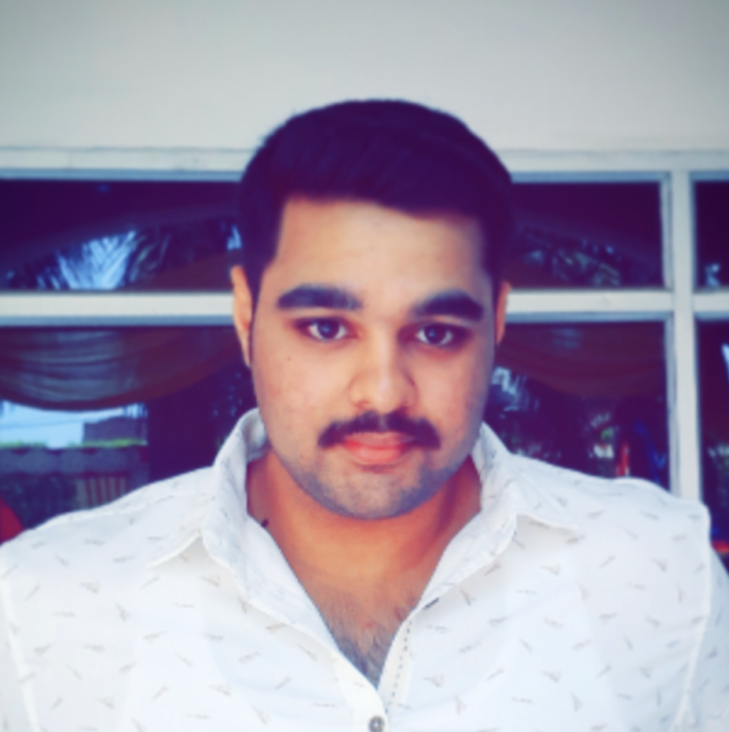

### Heya ! 😀, This is **`Shaurya Sarswat`**

DSA Enthusiast (Solved 1000+ Problems @LeetCode and @GFG) | 3⭐️ LeetCode(Rating : 1547) | Top 2 Institute Rank GFG | 5⭐️ HackerRank | Data Science & Machine Learning | Full-Stack Development | Content Writing & Blogging

### Engineer @ 2024 👷🏻

<b> Education </b>

    Dr. A.P.J. Abdul Kalam Technical University

    Bachelor of Technology in Computer Science and Engineering
    July 2020 - July 2024

    CGPA : 8.43 / 10

    - Attended 3 industrial trainings and created Mini-Projects 📽️
    - Winner of CODEWARS hackathon 👨🏻‍💻
    - Runner up at A.K.T.U. Sports Fest Basketball 🏀

    St. Mary's Convent Sr. Sec. School

    Class XII - C.B.S.E. (P.C.M. + Computer Science)
    April 2020

    Percentage : 91.0 %

    - Won Silver Medal at InterSchool quiz competition 🧐
    - Won 1 Gold 🥇 2 Silver 🥈 Medals at Cyber and English Olympiads respectively

    St. Mary's Convent Sr. Sec. School

    Class X - C.B.S.E. (Science)
    April 2020

    Percentage : 90.8 %

    - Winner of InterSchool Basketball tournament 🏀

    
